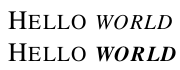

# Italic small caps in Times Roman for LaTeX

Standard LaTeX does not provide italic small caps. For example,
```
\documentclass{article}
\usepackage{times}
\begin{document}
\textsc{Hello \emph{world}}
\end{document}
```
produces:


The times-itsc package provided here fixes this, to give:



To use the package:

1. Unpack [this tar.gz file](times-itsc.tar.gz) in your texmf hierachy
2. Run `mktexlsr` or `texhash`
3. Then use the `times-itsc` package in place of the times package.

The files are generated using fontinst; to generate the files, clone
this git reporsitory and type `make`.

Thanks to [Daniel Ashbrook](https://wiki.cc.gatech.edu/ccg/people/dan)
for helpful comments on an earlier version of this page.
